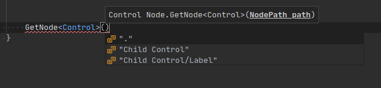
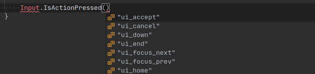

# C# Tools for Godot

Debugger and utilities for working with Godot C# projects in VSCode.

## Requirements

**Godot 3.2.2** or greater. Older versions of Godot are not supported.

## Features

- Debugging.
- Launch a game directly in the Godot editor from VSCode.
- Additional code completion for Node paths, Input actions, Resource paths, Scene paths and Signal names.

**NOTES:**
- A running Godot instance must be editing the project in order for `Play in Editor` and the code completion to work.
- Node path suggestions are provided from the currently edited scene in the Godot editor.
- Currently Signal suggestions are only provided using the information from the project build
results, not from the information in the edited document. This will change in the future.

## VSCode installation and configuration

- Install via extensions marketplace by searching for `neikeq.godot-csharp-vscode`.
- Once installed, you have to create the debug configurations from the Debug panel like this:

- Choose C# Godot:

- It will generate the following. The `Play in Editor` option works out of the box. For the Launch you need to fix the path to point to the Godot Editor executable path you're using:

## Debugger launch configurations

By default the extension creates the following launch configurations:

- **Play in Editor**\
  Launches the game in the Godot editor for debugging in VSCode.\
  For this option to work, a running Godot instance must be editing the project.
- **Launch**\
  Launches the game with a Godot executable for debugging in VSCode.\
  Before using this option, the value of the _"executable"_ property must be changed
  to a path that points to the Godot executable that will be launched.
- **Attach**\
  Attaches to a running Godot instance that was configured to listen for a debugger connection.

## Screenshots

