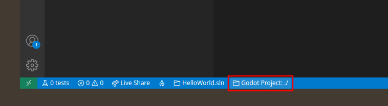
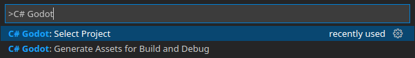
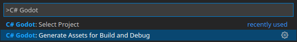
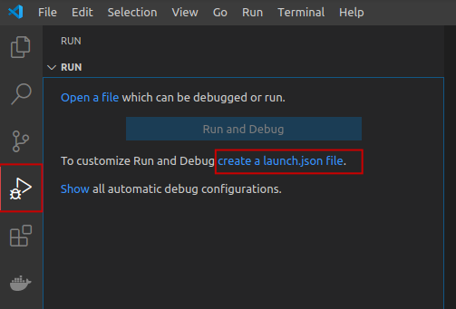
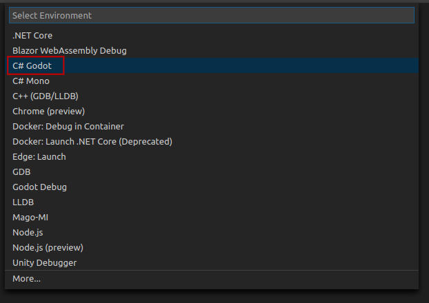
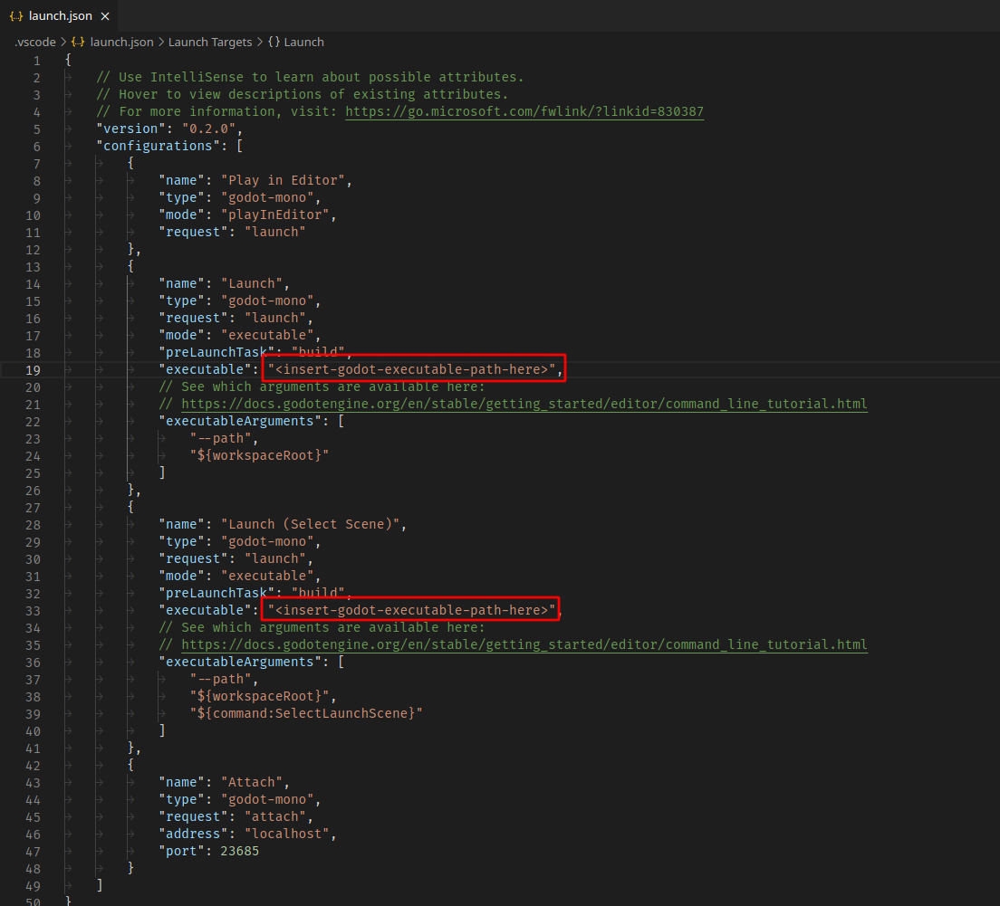

# C# Tools for Godot

Debugger and utilities for working with Godot C# projects in VSCode.

## Requirements

**Godot 3.2.2** or greater. Older versions of Godot are not supported.

## Features

- Debugging.
- Launch a game directly in the Godot editor from VSCode.
- Additional code completion for Node paths, Input actions, Resource paths, Scene paths and Signal names.

**NOTES:**
- A running Godot instance must be editing the project in order for `Play in Editor` and the code completion to work.
- Node path suggestions are provided from the currently edited scene in the Godot editor.
- Currently Signal suggestions are only provided using the information from the project build
results, not from the information in the edited document. This will change in the future.

## VSCode installation and configuration

Install via extensions marketplace by searching for [`neikeq.godot-csharp-vscode`](https://marketplace.visualstudio.com/items?itemName=neikeq.godot-csharp-vscode).

### Multiple Project setup

If the current workspace contains multiple Godot projects, the extension will prompt you to select the one you want to use with the extension on opening the workspace in VSCode. The selected project can be changed anytime from the status bar or using the `Select Project` command.

- **Option 1.** Using the status bar:
  - Click on the Godot project status bar item.\
    
  - Select the Godot project you want to use.

- **Option 2.** Using the `Select Project` command:
  - Open the Command Palette (<kbd>Ctrl</kbd> + <kbd>P</kbd>).
  - Select `C# Godot: Select Project`.\
    
  - Select the Godot project you want to use.

### Setup debugging

To debug a Godot project you have to create the [debugger launch configurations](#debugger-launch-configurations). It can be created from the Debug panel or by using the `Generate Assets for Build and Debug` command.

- **Option 1.** Using the `Generate Assets for Build and Debug` command:
  - Open the Command Palette (<kbd>Ctrl</kbd> + <kbd>P</kbd>).
  - Select `C# Godot: Generate Assets for Build and Debug`.\
    
  - If debugger configurations already exist, you will be prompted if you want to override them.
  - It will have generated the `launch.json` and `tasks.json` files in the `.vscode` directory.\
    See the [debugger launch configurations](#debugger-launch-configurations), some configurations
    may require more setup.

- **Option 2.** From the **Debug panel**:
  - If debugger configurations already exist, remove them or use the
    `Generate Assets for Build and Debug` command to override them.
  - Click on `create a launch.json file`.\
    
  - Select `C# Godot`.\
    
  - It will have generated the `launch.json` and `tasks.json` files in the `.vscode` directory.\
    See the [debugger launch configurations](#debugger-launch-configurations), some configurations
    may require more setup.

### Additional `Launch` configuration

The `Launch` [debugger configurations](#debugger-launch-configurations) requires additional setup. The _"executable"_ property must be set to a path that points to the Godot executable that will be launched. By default, the extension tries to automatically populate this property with the path to the running Godot instance but if there isn't one it needs to be set manually:

You can also set the `godot.csharp.executablePath` setting to the path that points to the Godot executable that will always be used when generating the debugger configurations so you won't have to set it manually everytime.

The [generated debugger configuration](#setup-debugging) will also create a `tasks.json` that contains a build task for building the project from VSCode which is used by the `Launch` configuration in order to build the project before launching (this is configured in the _"preLaunchTask"_ property of the configuration and can be removed).

The build task uses the Godot executable to build the the C# project (this is configured in the _"command"_ property and must be configured like the _"executable"_ property of the `Launch` configuration if the extension could not find the right path). The build task can be modified to execute the `dotnet` command directly instead or modify the [Godot CLI arguments](https://docs.godotengine.org/en/3.4/getting_started/editor/command_line_tutorial.html#command-line-reference).

## Debugger launch configurations

By default the extension creates the following launch configurations:

- **Play in Editor**\
  Launches the game in the Godot editor for debugging in VSCode.\
  For this option to work, a running Godot instance must be editing the project.
- **Launch**\
  Launches the game with a Godot executable for debugging in VSCode.\
  This option requires the value of the _"executable"_ property to be set to
  a path that points to the Godot executable that will be launched.\
  The `godot.csharp.executablePath` setting can be configured to automatically populate the
  executable property with its value, if not configured it will be populated with the path
  to the running Godot instance if there is one, otherwise it will have to be populated manually.
  See [additional `Launch` configuration](#additional-launch-configuration).
- **Launch (Select Scene)**\
  Launches the game with a Godot executable for debugging in VSCode, allowing the user
  to select which scene to run on every execution.\
  This option works just like the `Launch` option and also requires the value
  of the _"executable"_ property to be set.
  See [additional `Launch` configuration](#additional-launch-configuration).
- **Attach**\
  Attaches to a running Godot instance that was configured to listen for a debugger connection.

## Screenshots

